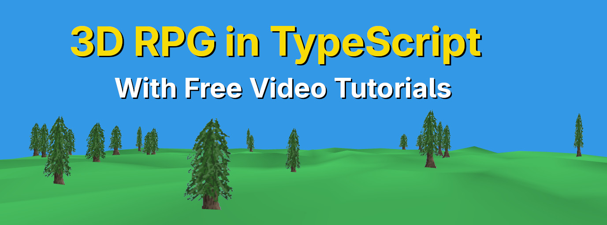

# 3D RPG in TypeScript

Would you like to build a 3D RPG with TypeScript and WebGL2? This
code is from a **free video series on YouTube** which you can watch
to build a game like this step-by-step!

The playlist on YouTube for each step can be found here: [TODO Add]

# Quickstart

0. Ensure that [NodeJS](https://nodejs.org/en) and [NPM](https://www.npmjs.com/) are installed on your machine.
1. Open a terminal at the project location. In VSCode, go to the top where it says Terminal, and click New Terminal. If you don't see terminal, you may see three dots near the top left, click those and see if Terminal is under those.
2. Run `npm run dev` to run the development server, where you can see the game refresh on your local machine as you develop.
3. Run `npm run build` to output an HTML, CSS and JavaScript file under game/dist, which you can put on a website.

# Using the Code in Your Own Games

You are absolutely allowed to use the code and assets from this game in your own games, even commercially and even in closed source games you make, as long as you agree to this [fairly permissive license](./LICENSE) included in this project.

My goal is to help you in making your own games, and I hope this work can be of value to you.